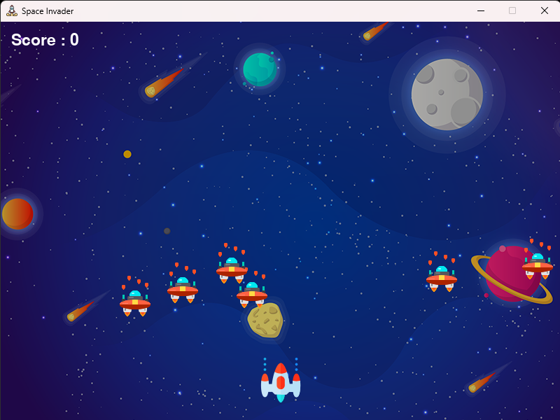

# Space Invader
It is a Fun Game on which is created using Python (Module Used - Pygame)

## Features
- The Game has one fighter Space-Ship (Player) and six intruders (Enemies)
- Player can control the Space-Ship using arrow keys (left-right)
- Player can fire bullets using space bar
- Enemies are Respawned as Player shoots them
- Game will ended as any one of the enemy touches the Space-Ship
- Import Pygame module to Play this Game

## Sneak Peak

## Technology Used

## Created By

- Atul Agrawal [@Newbie-coder91](https://www.github.com/Newbie-coder91)